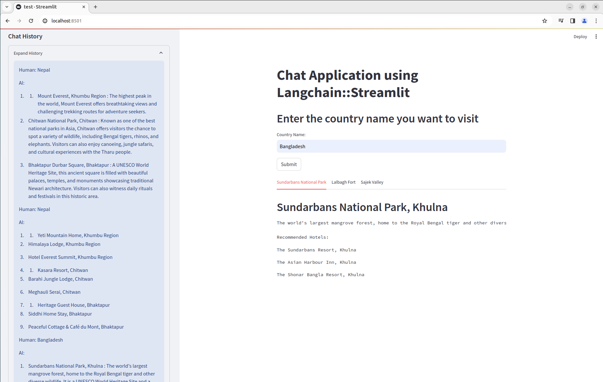
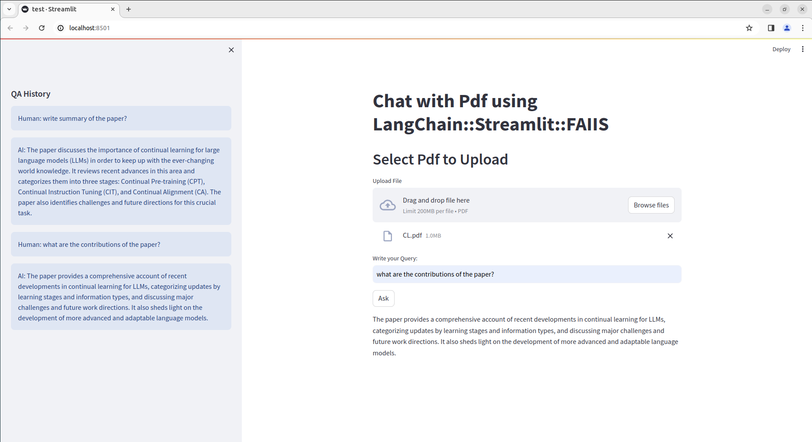

# Chat Application using LangChain::Streamlit::FastAPI
This repository provides sample code for developing Chat application using Langchain framework (OpenAI). For GUI development Streamlit has been used. Furthermore, to demonstrate web API based application, FastAPI has ben employed. 


## Output
<p align="center" style="text-align: center;">
    
</p>

<p align="center" style="text-align: center;">
    
</p>


## Dependencies:
This repository is dependent on the following packages:
- langchain
- openai
- streamlit
- fastapi
- faiss-client
- pypdf
- python-dotenv
- Requests


## Running Streamlit Application:
```
streamlit run test.py

```

## Running UniCorn Server to access FastAPI:
```
uvicorn modelapi::api --reload

```

## Checking FastAPI endpoint
```
http://127.0.0.1:8000/docs
```

## Running Streamlit Application that uses API:
```
streamlit run testapi.py

```